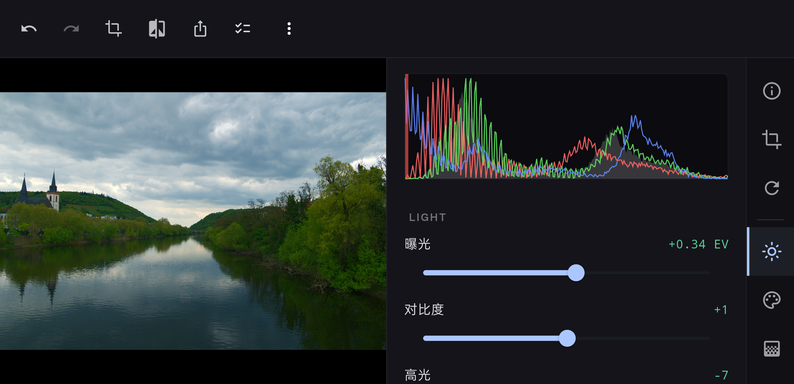

<div align="center">


# e4pix



联机拍摄 + 实时 RAW 调色

[简体中文](#简体中文) | [English](#english)

</div>

---

## 简体中文

跨平台的 RAW 修图工具，连接相机即可实时调色。

### 功能

- 联机拍摄（USB）；文件夹监控
- RAW 实时调色：曝光、对比、高光阴影、白平衡、HSL 色相、LUT (.cube)
- 裁剪 / 旋转 / 翻转 / 拉直
- 局部调整：线性 / 径向渐变，画笔（流量、硬度、加擦、自动蒙版）
- 智能区域：相近色选择
- 主体分割：可自动区分主体，正负点细化
- AI 调色建议：目前适配 Claude / GPT / DeepSeek
- Material You：跟随系统壁纸 / 强调色，也可自选种子色
- 预设、撤销重做、直方图、前后对比、批量导出

### 平台

Windows、Android 已测。macOS / Linux / iOS 未适配。

### 编译

LibRaw 走 submodule：

```bash
git clone --recursive [https://github.com/yusuaois/e4pix.git](https://github.com/yusuaois/e4pix.git)
cd e4pix

```

已经 clone 过：

```bash
git submodule update --init --recursive

```

依赖：

- Flutter SDK
- Windows：Visual Studio 2022 + C++ 桌面开发
- Android：Android Studio + NDK

LibRaw 在 `flutter run` 时自动编译进项目。EdgeSAM 模型已打包在 `assets/models/`。

```bash
flutter pub get
flutter run -d windows   # 或 -d android

```

AI 功能在「设置 → AI 配置」里填 Key，仅本地存。

### 许可证

[Apache License 2.0](https://www.google.com/search?q=LICENSE)

---

## English

Cross-platform RAW editing tool, connect your camera for real-time color grading.

### Features

- Tethered shooting (USB); folder monitoring
- Real-time RAW color grading: exposure, contrast, highlights/shadows, white balance, HSL hue, LUT (.cube)
- Crop / rotate / flip / straighten
- Local adjustments: linear / radial gradients, brush (flow, hardness, add/erase, auto-mask)
- Smart Region: selection by color similarity
- Subject Segmentation: automatic subject identification with positive/negative points for refinement
- AI color grading suggestions: currently supports Claude / GPT / DeepSeek
- Material You: follows system wallpaper / accent color, or choose your own seed color
- Presets, undo/redo, histogram, before/after comparison, batch export

### Platforms

Tested on Windows and Android. macOS / Linux / iOS are not supported yet.

### Build

LibRaw uses a submodule — clone with `--recursive`:

```bash
git clone --recursive [https://github.com/yusuaois/e4pix.git](https://github.com/yusuaois/e4pix.git)
cd e4pix

```

If already cloned:

```bash
git submodule update --init --recursive

```

Requirements:

- Flutter SDK
- Windows: Visual Studio 2022 + Desktop development with C++
- Android: Android Studio + NDK

LibRaw builds automatically during `flutter run`. EdgeSAM models are already bundled in `assets/models/`.

```bash
flutter pub get
flutter run -d windows   # or -d android

```

For AI features, fill in your API key in **Settings → AI Configuration**. It is only stored locally.

### License

[Apache License 2.0](https://www.google.com/search?q=LICENSE)
