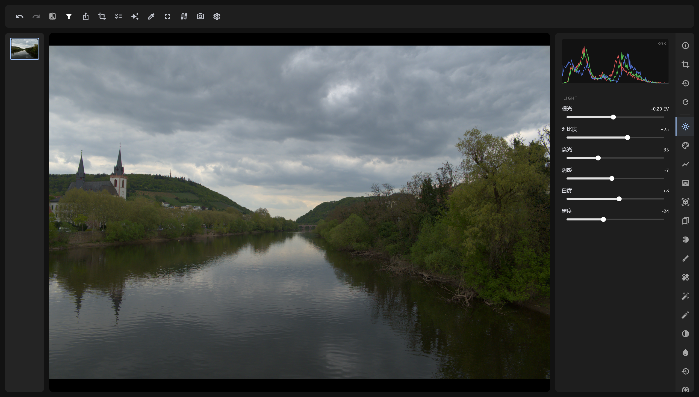

<div align="center">


# e4pix



**RAW 格式照片调色与联机拍摄软件** — 像 Lightroom 一样调色，像 Capture One 一样联机

[简体中文](#简体中文) | [English](#english)

</div>

---

## 简体中文

e4pix 是一款跨平台的 RAW 照片编辑与联机拍摄工具。它从联机拍摄起步——相机按下快门，设备上立刻出图调色——逐步加入了常规图片格式支持，现在 RAW、JPEG、PNG 都能处理。

底层使用 **LibRaw**（通过 FFI 调用 C++ 原生库）解码 RAW 文件，搭配 **GPU 着色器渲染管线**，所有调色参数在 GPU 上实时计算，保证即时预览的流畅体验。状态管理基于 **Riverpod**，渲染引擎使用 Flutter **FragmentProgram** 自定义着色器。

### 核心功能

#### 调色引擎
- **基础调光**：曝光、对比度、高光、阴影、白色、黑色
- **白平衡与色彩**：色温、色调、饱和度、自然饱和度
- **HSL 分频调色**：8 波段（红/橙/黄/绿/青/蓝/紫/品红）× 3 通道（色相/饱和/明度）
- **RGB 曲线**：主曲线 + 红/绿/蓝/亮度四个独立通道，控制点拖拽编辑
- **LUT 色彩查找表**：支持 `.cube` / `.vlt` 格式，A、B 双槽串联，每张图独立记忆

#### 降噪与锐化
- **降噪**：明度 / 颜色两路独立控制。预览用 GPU 实时降噪，导出可选 CPU 多线程并行（双边滤波）或 GPU
- **锐化**：USM（Unsharp Mask），可控数量、半径、蒙版阈值
- **胶片颗粒**：可控数量、大小、阴影/高光阈值与强度、R/B 通道比、相关性、色彩保护

#### 局部调整
- **三种蒙版**：线性渐变、径向渐变、画笔
- **画笔参数**：流量、硬度、加色/擦除模式
- **自动蒙版**：基于色差智能识别边缘，涂抹时自动贴合物体轮廓
- **导向滤波**：收边优化，消除锯齿
- **智能选区**：SAM（Segment Anything Model）主体分割，正负点细化；相近色连通区域自动扩选
- 最多 4 个局部调整层

#### 裁剪与变换
- 旋转、翻转、拉直
- 自由裁剪 + 固定比例约束
- EXIF 方向自动矫正

#### 取色器
- 悬停/点击读取任意像素的 RGB 和 HEX 值

#### 水印边框
- **背景**：纯色 / 原图模糊 / 自定义图片
- **Logo**：13 个内置品牌（深色/浅色双版本），支持自定义 Logo 图片
- **EXIF 信息**：自动提取相机型号、焦距、参数，或手动输入文本
- **布局**：信息层可选图片上方/下方/四角叠加；画布比例可选原生/1:1/4:5/16:9 等
- **质感**：圆角、阴影强度、边框宽度、文字字体与粗细
- **预览与导出一致**：统一的几何布局模型，预览所见即导出所得

#### 联机拍摄
- **USB 直连**：通过 gPhoto2 控制相机，快门触发即传
- **文件夹监控**：Dropbox / Syncthing 等同步文件夹自动识别新文件
- RAW+JPEG 同时传输时可仅保留 RAW
- 批量同步参数到多张照片
- 参数随图持久化（`.e4pix.json` / `.xmp` 边车文件），跨设备迁移

#### 导出
- **后台队列**：导出不阻塞编辑，排队慢慢跑
- **批量导出**：多选照片一次导出
- **文件名模板**：支持 `{name}` `{seq}` `{date}` `{camera}` `{iso}` 等占位符
- **随时取消**：各阶段均有取消检查点
- **水印合成**：导出时自动合成水印边框

#### 其他
- **预设**：保存/应用自定义调色预设
- **历史记录**：无限撤销/重做，300ms 防抖推送
- **星标旗标筛选**：标星/标旗/标色，快速筛选
- **直方图**：实时 RGB 直方图，可拖拽位置
- **前后对比**：垂直分屏或并排对比修改前后效果
- **解码缓存**：已浏览图片秒开，LRU 缓存
- **AI 调色建议**：支持 Claude / GPT / DeepSeek，自动分析图片并推荐参数
- **Material You 主题**：跟随系统壁纸或自选种子色
- **应用内更新**：检查 GitHub Release 自动更新
- **自定义键位**：几乎所有操作都能重新绑定快捷键
- **中英文**：完整国际化支持

### 性能优化（v1.4）

- 自动蒙版引导图回读带宽减少 ~90%，大面积涂抹不掉帧
- 曲线编辑器加入拖拽节流，手指跟随更灵敏
- 水印导出模糊背景 GPU 轮次从 3 次降至 2 次
- 手机底部面板拖拽去抖，减少不必要重绘
- 手机 TabBarView 懒加载，首次打开面板速度提升 50-70%
- 局部调整蒙版缓存限制 8 条目，防止长时间使用内存增长
- Shader 预编译，消除首帧卡顿
- Develop Pass 缓存 3 条目 LRU，撤销重做秒切

### 技术架构

| 层 | 技术 |
|---|------|
| UI 框架 | Flutter 3.x，响应式布局（桌面侧栏 / 手机底部 Tab） |
| 状态管理 | Riverpod（Notifier + Provider） |
| RAW 引擎 | LibRaw（C++），通过 `dart:ffi` 在后台 Isolate 中解码 |
| 渲染管线 | Flutter FragmentProgram（SkSL 着色器），多 pass GPU 渲染 |
| AI 分割 | EdgeSAM（ONNX Runtime），智能区域（颜色连通 + 导向滤波） |
| 持久化 | `.e4pix.json` 边车文件 + `.xmp` 兼容格式 |
| 联机 | gPhoto2（USB 控制）+ 热文件夹监控 |
| 主题 | Material 3 / Material You（Dynamic Color） |
| 国际化 | EasyLocalization（en / zh-CN） |

### 平台

| 平台 | 状态 |
|------|------|
| Windows | ✅ 主力开发平台 |
| Android | ✅ 已适配（arm64-v8a / universal） |
| macOS | 🚧 计划中 |
| Linux | 🚧 计划中 |
| iOS | 🚧 计划中 |

### 编译与运行

```bash
# 克隆（LibRaw 为 submodule）
git clone --recursive https://github.com/yusuaois/e4pix.git
cd e4pix

# 安装依赖
flutter pub get

# 运行
flutter run -d windows   # Windows
flutter run -d android   # Android
```

**环境要求**：
- Flutter SDK 3.x+
- Windows：Visual Studio 2022 +「使用 C++ 的桌面开发」
- Android：Android Studio + NDK
- LibRaw 在 `flutter run` 时自动通过 CMake 编译
- EdgeSAM 模型已打包在 `assets/models/`

**AI 功能**：在「设置 → AI 配置」中填入 API Key，仅存储在本地。

### 许可证

[GPL v3](LICENSE)

---

## English

e4pix is a cross-platform RAW photo editor and tethering tool. It began as a tether-only app — shoot on camera, edit instantly on device — and grew to support common image formats. Today it handles RAW, JPEG, and PNG with equal capability.

Under the hood: **LibRaw** (C++ via FFI) for RAW decoding, a custom **GPU shader pipeline** for real-time color grading, and **Riverpod** for state management.

### Features

#### Color Engine
- **Basic adjustments**: Exposure, contrast, highlights, shadows, whites, blacks
- **White balance & color**: Temperature, tint, saturation, vibrance
- **HSL bands**: 8 color bands × 3 channels (hue, saturation, luminance)
- **RGB curves**: Master curve + independent R/G/B/luminance channels with draggable control points
- **LUTs**: `.cube` / `.vlt` format, dual slots (A/B) in series, remembered per image

#### Denoise & Sharpen
- **Denoise**: Luma and color channels independently controlled. GPU for preview; CPU multi-isolate parallel (bilateral filter) or GPU for export
- **Sharpen**: Unsharp Mask with amount, radius, and masking threshold
- **Film grain**: Amount, size, shadow/highlight thresholds & strengths, R/B channel ratios, correlation, color preservation

#### Local Adjustments
- **Three mask types**: Linear gradient, radial gradient, brush
- **Brush controls**: Flow, hardness, add/erase mode
- **Auto-mask**: Edge-aware painting that snaps to object boundaries
- **Guided filter**: Edge refinement for clean mask edges
- **Smart selections**: SAM (Segment Anything Model) subject segmentation with point refinement; connected-color region growing
- Up to 4 local adjustment layers

#### Crop & Transform
- Rotate, flip, straighten
- Free crop + fixed aspect ratio constraints
- Auto EXIF orientation correction

#### Color Picker
- Hover/click any pixel for RGB and HEX values

#### Watermark & Border
- **Background**: Solid color / blurred original / custom image
- **Logo**: 13 built-in brand logos (light/dark variants), custom logo support
- **EXIF overlay**: Auto-extract camera, lens, settings, or enter custom text
- **Layout**: Info placed above/below/overlaid at four corners; canvas aspect ratio presets (native, 1:1, 4:5, 16:9, etc.)
- **Aesthetics**: Rounded corners, drop shadows, border width, font family & weight
- **WYSIWYG**: Shared geometry model ensures preview matches export exactly

#### Tethered Shooting
- **USB**: gPhoto2 camera control, instant transfer on shutter
- **Hot folder**: Monitors Dropbox/Syncthing folders for new files
- RAW+JPEG with RAW-only option
- Batch sync edits across shots
- Sidecar persistence (`.e4pix.json` / `.xmp`), portable across machines

#### Export
- **Background queue**: Non-blocking, queue up exports and keep editing
- **Batch**: Multi-select and export in one go
- **Filename templates**: `{name}` `{seq}` `{date}` `{camera}` `{iso}` and more
- **Cancellable**: Checkpoints between every stage
- **Watermark compositing**: Automatic watermark/border application on export

#### More
- **Presets**: Save and apply custom grading presets
- **Undo/redo**: Infinite history with 300ms debounce
- **Star/flag filtering**: Rate, flag, color-label, filter
- **Histogram**: Live RGB, draggable
- **Before/after**: Vertical split or side-by-side comparison
- **Decode cache**: LRU cache, instant re-open of browsed images
- **AI suggestions**: Claude / GPT / DeepSeek analyze and recommend edits
- **Material You**: Dynamic color from wallpaper or custom seed
- **In-app updates**: GitHub Release auto-update
- **Custom keybindings**: Nearly every action rebindable
- **i18n**: English and Simplified Chinese

### Tech Stack

| Layer | Technology |
|-------|-----------|
| UI | Flutter 3.x, responsive (desktop sidebar / mobile bottom tabs) |
| State | Riverpod (Notifier + Provider) |
| RAW engine | LibRaw (C++) via `dart:ffi`, background isolates |
| Render pipeline | Flutter FragmentProgram (SkSL shaders), multi-pass GPU |
| AI segmentation | EdgeSAM (ONNX Runtime), smart region (color connectivity + guided filter) |
| Persistence | `.e4pix.json` sidecar + `.xmp` compatible |
| Tethering | gPhoto2 (USB) + hot folder watcher |
| Theming | Material 3 / Material You (Dynamic Color) |
| i18n | EasyLocalization (en / zh-CN) |

### Platforms

| Platform | Status |
|----------|--------|
| Windows | ✅ Primary target |
| Android | ✅ Supported (arm64-v8a / universal) |
| macOS | 🚧 Planned |
| Linux | 🚧 Planned |
| iOS | 🚧 Planned |

### Build

```bash
git clone --recursive https://github.com/yusuaois/e4pix.git
cd e4pix
flutter pub get
flutter run -d windows   # or -d android
```

**Requirements**: Flutter SDK 3.x+, Visual Studio 2022 (Windows) or Android Studio + NDK (Android). LibRaw builds automatically via CMake. EdgeSAM models bundled in `assets/models/`.

**AI**: Add your API key under **Settings → AI Configuration**. Stored locally only.

### License

[GPL v3](LICENSE)
